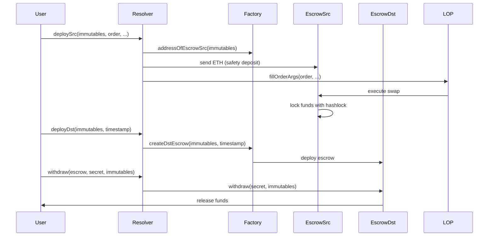

# Architecture Documentation - Unite DeFi Cross-Chain Swap

This document provides a comprehensive overview of the technical architecture, design decisions, and implementation details of the Unite DeFi cross-chain swap platform.

## 🏗️ System Overview

The Unite DeFi platform implements a secure cross-chain swap system using 1inch Fusion+ technology with HTLC (Hash Time-Locked Contract) security mechanisms. The system enables atomic swaps between different blockchain networks while maintaining security and trustlessness.

### Core Components

```
┌─────────────────┐    ┌─────────────────┐    ┌─────────────────┐
│   Frontend UI   │    │  Backend Relayer│    │ Smart Contracts │
│   (Next.js)     │◄──►│   (Node.js)     │◄──►│   (Solidity)    │
└─────────────────┘    └─────────────────┘    └─────────────────┘
         │                       │                       │
         │                       │                       │
         ▼                       ▼                       ▼
┌─────────────────┐    ┌─────────────────┐    ┌─────────────────┐
│   MetaMask      │    │   RPC Providers │    │   Blockchain    │
│   Wallet        │    │   (Alchemy/     │    │   Networks      │
│   Integration   │    │    Infura)      │    │   (Sepolia/     │
└─────────────────┘    └─────────────────┘    │   Monad)        │
                                              └─────────────────┘
```

## 🔐 Security Architecture

### HTLC (Hash Time-Locked Contract) Mechanism

The system uses HTLC to ensure atomic swaps:

1. **Hashlock**: A cryptographic hash prevents premature fund release
2. **Timelock**: Time-based constraints allow cancellation after timeout
3. **Atomic Execution**: Either both swaps succeed or both fail
4. **Secret Verification**: Cryptographic proof of swap completion

### Security Flow

```
1. User creates swap order
   ↓
2. Generate random secret (S)
   ↓
3. Create hashlock H = hash(S)
   ↓
4. Deploy source escrow with hashlock H
   ↓
5. Deploy destination escrow with hashlock H
   ↓
6. Execute source swap (funds locked with H)
   ↓
7. Reveal secret S on destination chain
   ↓
8. Complete destination swap (using S)
   ↓
9. Release funds to user
```

### Security Properties

- **Atomicity**: Both swaps succeed or both fail
- **Timeliness**: Timeouts prevent indefinite locking
- **Privacy**: Secret is only revealed when needed
- **Trustlessness**: No trusted third party required
- **Verifiability**: All operations are on-chain and verifiable

## 📦 Smart Contract Architecture

### Contract Hierarchy

```
EscrowFactory (1inch)
├── EscrowSrc (1inch)
│   ├── BaseEscrow (1inch)
│   └── Custom Logic
├── EscrowDst (1inch)
│   ├── BaseEscrow (1inch)
│   └── Custom Logic
└── Resolver (Custom)
    ├── Order Management
    ├── Secret Handling
    └── Cross-chain Coordination
```

### Key Contracts

#### 1. EscrowFactory
**Purpose**: Factory contract for deploying escrow instances
**Key Functions**:
- `createSrcEscrow()`: Deploy source escrow
- `createDstEscrow()`: Deploy destination escrow
- `addressOfEscrowSrc()`: Predict escrow address
- `addressOfEscrowDst()`: Predict escrow address

#### 2. EscrowSrc
**Purpose**: Source chain escrow for locking user funds
**Key Functions**:
- `withdraw()`: Release funds with secret
- `cancel()`: Cancel after timeout
- `getBalance()`: Check locked funds

#### 3. EscrowDst
**Purpose**: Destination chain escrow for receiving funds
**Key Functions**:
- `withdraw()`: Release funds with secret
- `cancel()`: Cancel after timeout
- `getBalance()`: Check locked funds

#### 4. Resolver
**Purpose**: Custom resolver for cross-chain coordination
**Key Functions**:
- `deploySrc()`: Deploy source escrow with safety deposit
- `deployDst()`: Deploy destination escrow
- `withdraw()`: Withdraw funds using secret
- `cancel()`: Cancel escrow after timeout
- `arbitraryCalls()`: Execute custom transactions

### Contract Interactions



## 🔄 Backend Relayer Architecture

### Service Architecture

```
┌─────────────────────────────────────────────────────────────┐
│                    Backend Relayer                          │
├─────────────────────────────────────────────────────────────┤
│  Express.js Server                                          │
│  ├── REST API Endpoints                                     │
│  ├── WebSocket Support (Future)                             │
│  └── Middleware (CORS, JSON, etc.)                          │
├─────────────────────────────────────────────────────────────┤
│  Core Services                                              │
│  ├── Contract Deployment Service                            │
│  ├── Order Management Service                               │
│  ├── Swap Execution Service                                 │
│  ├── Secret Management Service                              │
│  └── Status Tracking Service                                │
├─────────────────────────────────────────────────────────────┤
│  Blockchain Integration                                     │
│  ├── Ethers.js Providers                                    │
│  ├── Transaction Management                                 │
│  └── Event Monitoring                                       │
├─────────────────────────────────────────────────────────────┤
```

### Service Components

#### 1. Contract Deployment Service
- Manages contract deployment on both chains
- Handles deployment verification
- Stores contract addresses

#### 2. Order Management Service
- Creates swap orders with proper parameters
- Generates cryptographic secrets and hashlocks
- Manages order lifecycle

#### 3. Swap Execution Service
- Orchestrates cross-chain swap execution
- Handles transaction sequencing
- Manages error recovery

#### 4. Secret Management Service
- Generates and stores cryptographic secrets
- Manages secret revelation timing
- Ensures secret security

#### 5. Status Tracking Service
- Monitors swap progress
- Updates status in real-time
- Provides status API endpoints

### Data Flow

```
1. User Request
   ↓
2. API Endpoint Handler
   ↓
3. Service Layer Processing
   ↓
4. Blockchain Interaction
   ↓
5. Status Update
   ↓
6. Response to User
```

## 🎨 Frontend Architecture

### Component Architecture

```
App (Next.js)
├── Layout
│   ├── Header
│   └── Footer
├── SwapInterface (Main Component)
│   ├── WalletConnection
│   ├── BalanceDisplay
│   ├── TokenApproval
│   ├── OrderCreation
│   ├── SwapExecution
│   └── StatusTracking
└── Shared Components
    ├── Button
    ├── Input
    ├── Modal
    └── Loading
```

### State Management

```javascript
// Main state structure
const [state, setState] = useState({
  // Wallet state
  account: '',
  provider: null,
  signer: null,
  
  // Contract state
  contracts: null,
  relayerAddress: '',
  
  // Balance state
  sepoliaBalance: '0',
  monadBalance: '0',
  allowance: '0',
  
  // Transaction state
  isConnecting: false,
  isApproving: false,
  isSigning: false,
  
  // Status state
  approvalStatus: '',
  signatureStatus: ''
});
```

### API Integration

```javascript
// API service layer
class SwapAPI {
  static async deployFactories(userAddress) {
    return fetch('/api/deploy-factories', {
      method: 'POST',
      headers: { 'Content-Type': 'application/json' },
      body: JSON.stringify({ userAddress })
    });
  }
  
  static async createOrder(orderData) {
    return fetch('/api/create-order', {
      method: 'POST',
      headers: { 'Content-Type': 'application/json' },
      body: JSON.stringify(orderData)
    });
  }
  
  static async executeSwap(swapData) {
    return fetch('/api/execute-swap', {
      method: 'POST',
      headers: { 'Content-Type': 'application/json' },
      body: JSON.stringify(swapData)
    });
  }
  
  static async getSwapStatus(orderId) {
    return fetch(`/api/swap-status/${orderId}`);
  }
}
```

## 🌐 Network Architecture

### Supported Networks

#### Sepolia (Source Chain)
- **Chain ID**: 11155111
- **RPC**: Configurable (Alchemy, Infura, etc.)
- **Tokens**: WETH, USDC
- **Purpose**: Source of funds

#### Arbitrum Sepolia (Primary Destination)
- **Chain ID**: 421614
- **RPC**: Configurable (Alchemy, Infura, etc.)
- **Tokens**: WETH, USDC
- **Purpose**: Primary destination for funds

#### Monad Testnet (Alternative Destination)
- **Chain ID**: 10143
- **RPC**: https://rpc.testnet.monad.xyz
- **Tokens**: WETH, USDC
- **Purpose**: Alternative destination for funds

#### Etherlink Testnet (Alternative Destination)
- **Chain ID**: 128123
- **RPC**: https://node.ghostnet.etherlink.com
- **Tokens**: WETH, USDC
- **Purpose**: Alternative destination for funds

### Network Configuration

```javascript
const networkConfig = {
  11155111: { // Sepolia
    name: 'Sepolia',
    rpc: process.env.SRC_CHAIN_RPC,
    chainId: 11155111,
    tokens: {
      WETH: '0xfFf9976782d46CC05630D1f6eBAb18b2324d6B14',
      USDC: '0x1c7D4B196Cb0C7B01d743Fbc6116a902379C7238'
    },
    limitOrderProtocol: '0x0aa1A25F4AccAD28eF7069097f605149d4b5E025'
  },
  421614: { // Arbitrum Sepolia
    name: 'Arbitrum Sepolia',
    rpc: process.env.DST_CHAIN_RPC,
    chainId: 421614,
    tokens: {
      WETH: '0x980B62Da83eFf3D4576C647993b0c1D7faf17c73',
      USDC: '0x75faf114eafb1BDbe2F0316DF893fd58CE46AA4d'
    },
    limitOrderProtocol: '0x98A320BF204385A4508A043493D41118c8463f13'
  },
  10143: { // Monad Testnet
    name: 'Monad Testnet',
    rpc: 'https://rpc.testnet.monad.xyz',
    chainId: 10143,
    tokens: {
      WETH: '0xDA4b0cF402292e44D076ad6b461213c27ff4d1E6',
      USDC: '0x75faf114eafb1BDbe2F0316DF893fd58CE46AA4d'
    },
    limitOrderProtocol: '0x4aA294c0B461B454188053a7F055be5807f212B4'
  },
  128123: { // Etherlink Testnet
    name: 'Etherlink Testnet',
    rpc: 'https://node.ghostnet.etherlink.com',
    chainId: 128123,
    tokens: {
      WETH: '0x4aA294c0B461B454188053a7F055be5807f212B4',
      USDC: '0x75faf114eafb1BDbe2F0316DF893fd58CE46AA4d'
    },
    limitOrderProtocol: '0x0D0Be0B15F2ba435146FF9bf3397e26D3ffCCc81'
  }
};
```

## 🔧 Configuration Management

### Environment Variables

```bash
# Required Variables
PRIVATE_KEY=your_private_key
SRC_CHAIN_RPC=your_sepolia_rpc
DST_CHAIN_RPC=your_monad_rpc

# Optional Variables
PORT=3001
DEBUG=false
LOG_LEVEL=info
NODE_ENV=development
```

### Configuration Validation

```javascript
const ConfigSchema = z.object({
  SRC_CHAIN_RPC: z.string().url(),
  DST_CHAIN_RPC: z.string().url(),
  PRIVATE_KEY: z.string().min(64).max(66),
  PORT: z.number().default(3001),
  DEBUG: z.boolean().default(false)
});
```

## 📊 Monitoring and Observability

### Logging Strategy

```javascript
// Structured logging
const logger = {
  info: (message, data) => console.log(JSON.stringify({
    level: 'info',
    timestamp: new Date().toISOString(),
    message,
    data
  })),
  
  error: (message, error) => console.error(JSON.stringify({
    level: 'error',
    timestamp: new Date().toISOString(),
    message,
    error: error.message,
    stack: error.stack
  }))
};
```

### Metrics Collection

- **Transaction Success Rate**: Percentage of successful swaps
- **Average Execution Time**: Time from order to completion
- **Gas Usage**: Average gas consumption per operation
- **Error Rates**: Frequency of different error types
- **User Activity**: Number of active users and swaps

### Health Checks

```javascript
// Health check endpoint
app.get('/health', (req, res) => {
  const health = {
    status: 'healthy',
    timestamp: new Date().toISOString(),
    version: '1.0.0',
    uptime: process.uptime(),
    memory: process.memoryUsage(),
    connections: {
      srcChain: srcProvider.connection.url,
      dstChain: dstProvider.connection.url
    }
  };
  
  res.json(health);
});
```

## 🚀 Performance Considerations

### Optimization Strategies

#### 1. RPC Optimization
- Use dedicated RPC endpoints
- Implement connection pooling
- Cache frequently accessed data
- Monitor RPC response times

#### 2. Transaction Optimization
- Batch transactions where possible
- Optimize gas usage
- Use appropriate gas prices
- Implement retry mechanisms

#### 3. Frontend Optimization
- Implement proper loading states
- Use React.memo for expensive components
- Optimize bundle size
- Implement proper error boundaries

### Scalability Considerations

#### 1. Horizontal Scaling
- Multiple relayer instances
- Load balancing
- Database sharding (future)
- CDN for static assets

#### 2. Vertical Scaling
- Increase server resources
- Optimize database queries
- Implement caching layers
- Use connection pooling

## 🔒 Security Considerations

### Smart Contract Security

1. **Access Control**: Only authorized addresses can call critical functions
2. **Reentrancy Protection**: Prevent reentrancy attacks
3. **Input Validation**: Validate all inputs
4. **Overflow Protection**: Use SafeMath or Solidity 0.8+
5. **Timelock Mechanisms**: Prevent immediate fund extraction

### Backend Security

1. **Private Key Management**: Secure storage and rotation
2. **Input Validation**: Validate all API inputs
3. **Rate Limiting**: Prevent abuse
4. **Error Handling**: Don't expose sensitive information
5. **HTTPS**: Use HTTPS in production

### Frontend Security

1. **Wallet Integration**: Secure MetaMask integration
2. **Input Sanitization**: Sanitize user inputs
3. **Error Boundaries**: Graceful error handling
4. **Content Security Policy**: Implement CSP headers

## 🔄 Error Handling and Recovery

### Error Categories

1. **Network Errors**: RPC failures, network timeouts
2. **Transaction Errors**: Gas issues, contract reverts
3. **User Errors**: Insufficient funds, invalid inputs
4. **System Errors**: Internal failures, configuration issues

### Recovery Strategies

1. **Automatic Retry**: Retry failed transactions
2. **Fallback Mechanisms**: Use alternative RPC endpoints
3. **Graceful Degradation**: Continue operation with reduced functionality
4. **Manual Intervention**: Allow manual recovery for critical issues
